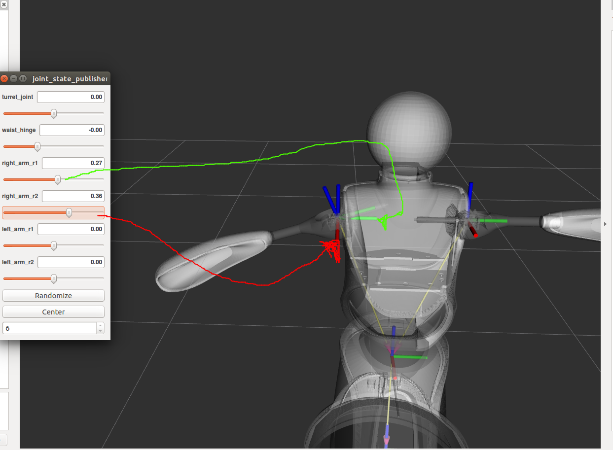
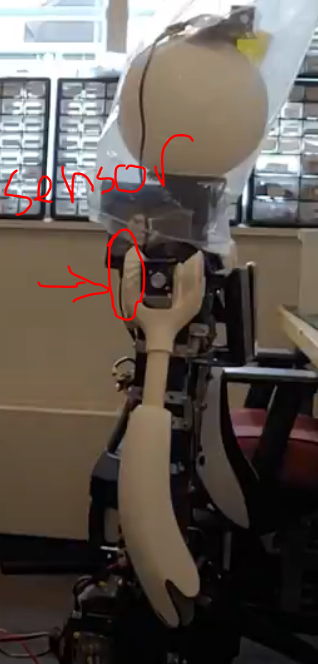
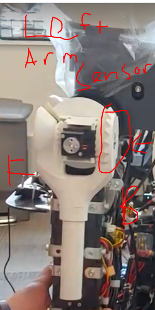

# Calibration

Calibration values for your robot can be found in [the values section](#values). See below for instructions on how to program each microcontroller. You should not need to recalibrate your robot. If you need to recalibrate your robot, likely due to a significant hardware modification or repair, see the steps below.

## Arm

You will need to set the zero position for the two sensors in each arm. This is done in the calibration configuration where the joints should read zero.

The arm should be straight out and the abduction axis of the shoulder joint facing forward. The part of the shoulder 3d printed piece with the sensor should be closest to the back for the right arm while for the left arm should be calibrated with the sensor face closest to the front of the robot. The two images of the left and right arms almost in calibration (the abduction is not zeroed since it is not perpendicular to the module as with the left most animation image), that is, the proper alignment in one axis for each showing how the sensor should be parallel to different faces depending on while arm you are working with.

Below, the target calibration position:



Right arm sensor alignment example:



Left arm sensor alignment example:



Flash the microcontroller for the arm you are calibrating with the code as instructed from [`quori_embedded`](https://github.com/Quori-ROS/quori_embedded); however, you will set the `ARM_ZERO_POSITION` variables in calibration.hpp to zero for the arm you are calibrating.

Next launch the controller file in quori_ros. You should now be able to view the sensor’s value by using rostopic echo to see the joint’s state. Use these value for their corresponding `ARM_ZERO_POSITION` variables. You can now flash the microcontroller with the update calibration. Verify the calibration was successful by reading the joint’s position in the zero configuration. The position should be reported as something close to zero.

## Waist

The waist has two sensors to calibrate. The raw value of each sensor is not displayed and so it is a bit more difficult to calibrate this. While there may be an easier option, here is one option for how to recalibrate the waist.

Each sensor for the waist is calibrated with the torso upright in its zero configuration.
The calibration value for the waist can be found by flashing the waist code from [`quori_embedded`](https://github.com/Quori-ROS/quori_embedded) with the `QUORI_CONFIG_ZERO_POSITION_WAIST` values as `0`.
You can then echo the joint’s state to get the proper calibration value for the waist.

For the QUORI_CONFIG_ZERO_POSITION_MOTOR, you will need to change the line with

```cpp
states.measured[0] = -state->waist[0];//state->measured[0];
```

To

```cpp
states.measured[0] = state->measured[0];
```

When you echo the joint’s position you will now be reading the motor position. Use this value for `QUORI_CONFIG_ZERO_POSITION_MOTOR`

Be sure to change the code back to its original state with

```cpp
states.measured[0] = -state->waist[0];//state->measured[0];
```

## Base

The base calibration does not require the microcontroller to be flashed. The calibration value is stored in `src/quori_controller/config/calibration.yaml`. To find the value to use for calibration set the value in the calibration file to `0`. Then:

- `roslaunch quori_controller quori_control_holo.launch`
- `roslaunch quori_teleop quori_teleop.launch`
- Hold the left bumper LB and use the thumbsticks to rotate the top plate of the base into your desired zero heading. [See teleop repo](https://www.google.com/url?q=https://github.com/Quori-ROS/quori_ros/tree/master/src/quori_teleop&sa=D&source=editors&ust=1703158334603099&usg=AOvVaw0ti8R1g06ZxG_J2iSaMmy2) for more information on how to command the robot
- `rostopic echo /quori/base/pos_status`
- Use the value reported in the echo above as the new calibration value in the calibration file

## Values

|     | **LEFT ARM**                     |                                  | **RIGHT ARM**                     |                                   | **SPINE**                          |                                    |                                                                 |         |         |
| --- | -------------------------------- | -------------------------------- | --------------------------------- | --------------------------------- | ---------------------------------- | ---------------------------------- | --------------------------------------------------------------- | ------- | ------- |
| Q#  | `QUORI_LEFT_ARM_ZERO_POSITION_X` | `QUORI_LEFT_ARM_ZERO_POSITION_Y` | `QUORI_RIGHT_ARM_ZERO_POSITION_X` | `QUORI_RIGHT_ARM_ZERO_POSITION_Y` | `QUORI_CONFIG_ZERO_POSITION_WAIST` | `QUORI_CONFIG_ZERO_POSITION_MOTOR` | `/opt/quori/quori_controller/config/calibration` `base_offset`: | Head dx | Head dy |
| 1   | -1.8                             | -2.0388                          | 1.93                              | -5.0388                           | 0.18                               | 0.9                                |                                                                 |         |         |
| 2   | 0.9434                           | 2.5247                           | 0.5737                            | -0.7704                           | -2.007                             | 1.6457                             | 0.0944                                                          | -2.5    | -1.65   |
| 3   | 2.9258                           | 2.1684                           | -1.1363                           | -0.53                             | -0.5515                            | -0.8114                            | 0.02606                                                         | -2.65   | -1.75   |
| 4   | -1.6475                          | 1.366                            | 2.3041                            | -2.2458                           | 0.6527                             | 0.1149                             | 0.72                                                            | -3      | -1.85   |
| 5   | 2.5998                           | 2.7943                           | -1.7496                           | 0.6588                            | -2.3031                            | 0.6666                             | 0.2982                                                          | -2.5    | -1.7    |
| 6   | -1.8658                          | -1.2782                          | 2.6999                            | -3.1018                           | 1.4965                             | 2.7852                             | 0.583958                                                        | -2.75   | -1.85   |
| 7   | -0.2711                          | 0.4138                           | -0.9802                           | 2.12                              | 1.7895                             | -2.3996                            | 0.201184                                                        | -2.9    | -1.4    |
| 8   | -2.32                            | -1.22                            | 1.381                             | -2.8062                           | 2.328                              | 0.9444                             | 0.93102                                                         | -3.2    | -1.9    |
| 9   | 1.582                            | -0.0153                          | -0.6412                           | -1.0186                           | 0.6627                             | -1.3553                            | 0.289568                                                        | -2.7    | -1.8    |
| 10  | -2.7                             | 1.273                            | -2.4                              | 0.016                             | 0.405                              | -0.7193                            | 0.347                                                           | -2.7    | -1.97   |
