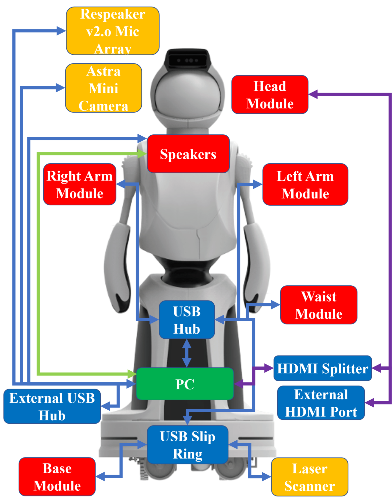

# Electronics

Each of the sensors and main components connect via standard connectors and communication interfaces for simplicity, modularity, and potential future reconfiguration.

The figure above shows the components and connection types.
Data are transferred via standard methods of USB 2.0 and 3.0 (blue lines), audio jack (green lines) and HDMI (purple lines).
Module and sensors are readily modified or replaced with other devices that communicate over USB.
A four-port USB hub and a one-port HDMI port are accessible from the back of the robot without removing any components.

The main connection type is USB with all connections using USB 2.0, except for the USB 3.0 RGB+D camera (Quori's default PC has multiple USB 3.0 ports for future upgrades).
HDMI transmits the head image data, allowing for future modifications.
A stereo audio cable from the PC 3.5-mm audio port transmits audio to the chest speakers.
A USB and HDMI port are accessible from the back panel of the robot for programming and debugging.

## Computer

Quori currently ships with a nuc8i7hvk: Intel© CoreTM i7-8809G Processor with RadeonTM RX Vega M GH graphics (8M Cache, up to 4.20 GHz). It has a 500 GB SSD and 16 GB of RAM

See [System](system.md) for more how to configure the PC.

## Microcontrollers

Quori has 4 microcontrollers that can be programmed. This is not recommended as the embedded software is designed to handle low level motor control such that the user does not need to think about the code and thus the user only needs to program on the computer to interface with the actuators over serial. That being said, in the case a microcontroller breaks you may need to reload the embedded software to your robot. Here is the information         you may need.