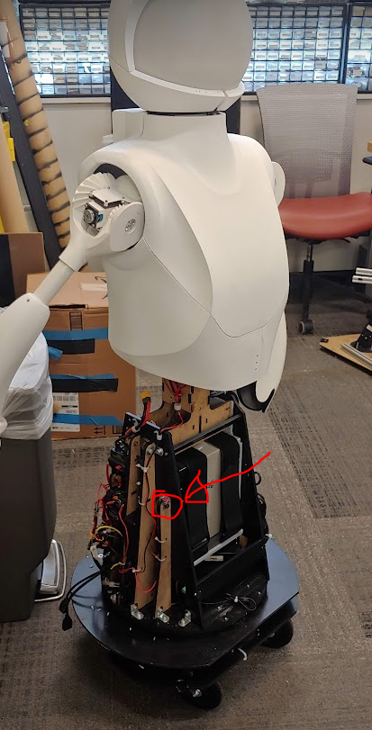
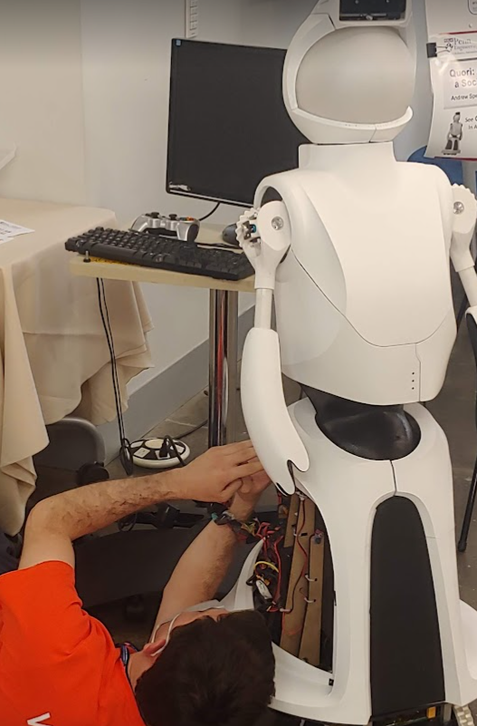
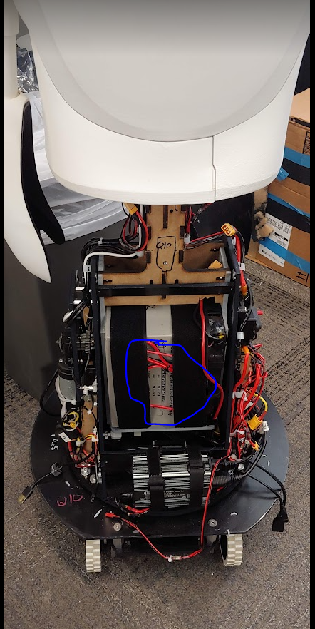
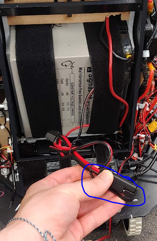
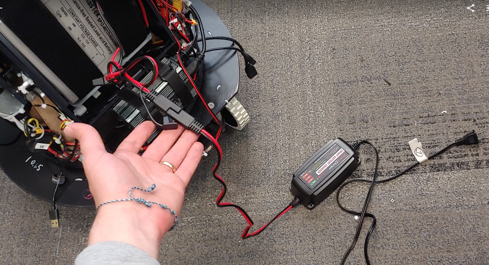
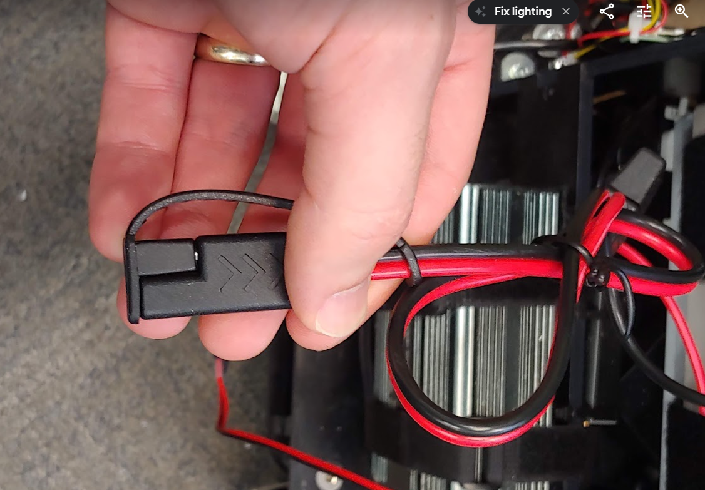
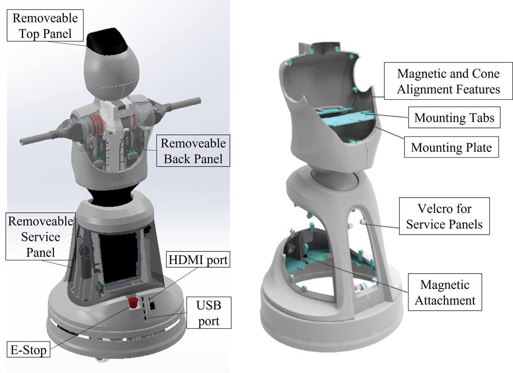

# General Use

## Safety

- Make sure your robot is [off](#powering-off) (the main breaker) before modifying any power configuration.
- The robot should be [off](#powering-off) if you are servicing any part of the robot.
  Make sure the motor Emergency stop is engaged (pushed down).
- Make sure all panels are on while operating the robot.
  This will prevent the robot and bystanders from getting hurt.
- Do not backdrive the arms. If you need to reposition the arms then make sure you power off the motors and move the shoulder at the gear and not the hand or arm. If you backdrive the arm by the hand or arm it will stress and wear down the arm gears and transmission and may lead to a break.

## Powering On

These instructions assume your robot is in the default configuration and your robot is fully assembled as described in the [Assembly/Disassembly section](setup/assembly.md).

Make sure the Emergency Stop is push in. This will prevent power to the motors.

Push in the red switch on the main breaker of Quori. You will need to remove the back service panel to access this.

To turn the PC on you will press the PC power button (for one second) on the front right of the robot.

When you are ready to power the motors on you can twist the Emergency Stop button to release the switch.

## Powering Off

1. Peel off the black siding around the base of the robot.
2. On the robot's right hand side there is a small box with a red button and
black lever (see area marked in red in the picture above). Press the red
button.
3. Put the black siding back on the robot.

## Recharging

The robot battery can be charged while mounted in the robot. Use the bullet connector cable that should be tucked under the battery velcro straps. Besure to secure the charger cable under the velcro when you are done charging. You will need to remove at least one of the black service panels to access the charging cable.

Next plug the charger into the battery cable. Do not plug the charger into AC power before this step.

Now connect the charger to AC power.

When you are done charging, place the cap over the charger cable connector and secure the cable under the velcro.

s

## Accessing the PC

You can run the robot on battery power or plug it into the wall. For different power configurations see [Power Configurations](hardware/power.md#power-configurations).

Plug in a monitor to your robot via an HDMI cable to the HDMI port (red in image below) on the back of the robot near the emergency stop button.

Plug in a usb keyboard and mouse to your robot from the USB hub (blue in image above) on the back of the robot near the emergency stop button.

Turn the main breaker on. Then press the PC on the button for one second to turn the PC on.  You should soon see the Qubuntu OS load up and show the Desktop on the monitor. You can set up WiFi and complete any other configurations from here.

With the PC running, you can [test](setup/testing.md) the robot's sensors and actuators.
