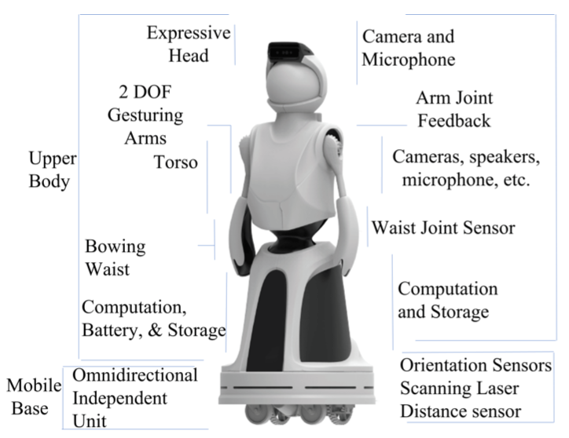
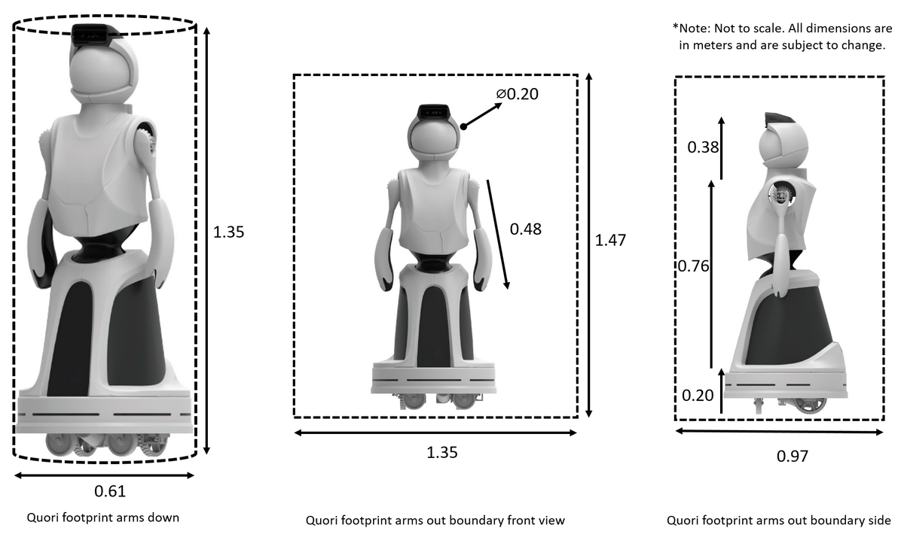

# Hardware

Quori is 1.35m tall, consisting of an expressive upper body attached to a omnidirectional mobile base.

## Key Features

## Key Dimensions

The four hardware modules
– [head](head.md), [arms](arms.md), [torso](torso.md), and [base](base.md) –
are described in the following sections, along with [their power](power.md) and sensor systems:
- [Head](head.md)
- [Arms](arms.md)
- [Torso and Waist](torso.md)
- [Mobile Base](base.md)
- [Power](power.md)
- [Electronics](electronics.md)
- [Sensors for Interaction](hri_sensors.md)
