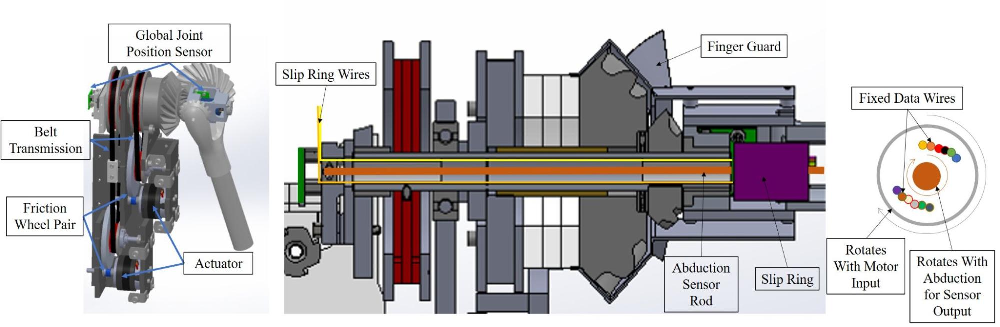

# Arms

Gestures are a key part of natural communication in social interaction.
Quori's arm design is affordable, modular, safe, and expandable.
The shoulder module (see illustration below) has two DoFs based on a [design by Whitney (2014)](https://doi.org/10.1109/ICRA.2014.6907768).
However, our design differs in the use of 3D-printed bevel gears instead of a capstan cable drive.
In addition, to save costs and complexity, we chose to *not* gravity-compensate the arm, thus, enabling the elbow and arm modules to be changed.
The arm is driven by brushless DC motors through a transmission consisting of a friction wheel pair and a timing belt speed reduction (see illustration below, left).
The entire arm module mounts to the spine with fasteners.

Left: CAD model of the arm module.
Center: A sectional view of the compact differential transmission.
Right: Section view of the arm differential highlighting how the torque is transferred while allowing 12 wires to be available to the arm with continual shoulder rotation.

Notable features of the arm design include resolution of the joint positions, drive motor abilities, and general safety considerations. The approximate resolutions of the joint position sensors are 0.022$^{\circ}$ and 0.075$^{\circ}$ for the shoulder joint (through the use of magnetic encoders on the output shafts, Fig.~\ref{fig:armcad}) and the drive motors, respectively. Access to both motor and shoulder positions allows the system to check for slippage between the friction wheel pair or timing belt stages, as well as perform automatic calibration upon boot-up of the system.

The arm motors can produce approximately 0.15Nm and are able to rotate at approximately 16 revolutions per second, resulting in  shoulder joint speeds up to $\sim$1.2 radians per second\footnote{This is based on the motor properties at 12 Volts operation.}.

The abduction/adduction DoF has a range of $\pm70^{\circ}$, and the circumduction DoF is continuous. The arm design is expandable; we designed access for power and/or communication for further joints in the arms (e.g., an elbow), while allowing the arm to rotate continuously. We achieved this via a shoulder joint slip ring with six available wires (rated to 2 A) (Fig.~\ref{fig:armcad}, right). As an example, two servo motors can be added as they only use three wires each. More DoF may be added through multiplexing. %

We used the following operational safety measures: a torque limit on the drive motors; a low-mass, low-inertia arm mechanism and structure that is safe according to the Head Injury Criterion \cite{zinn2004playing}; and a friction wheel designed to slip in case the motor generates too much torque or the arm is back-driven. %

Our primary goals in arm design were to ensure safe and precise yet fluid motion for expressivity, while maintaining affordability. Manipulation (i.e., carrying some payload or applying forces to the environment) was explicitly \textit{not} the goal of our design; thus, we used light-weight limbs and IQ Control's position controlled, direct drive, and brushless servo motors\footnote{http://iq-control.com}. Arms that would be expected to lift, push, or pull would need structural stability that typically leads to heavier and more expensive designs. Furthermore, heavier arms require larger and thus more expensive motors to move. Lower-cost motors or servos could be used at the expense of precision for the case of brushless DC motors \cite{piccoli2016anticogging}.

