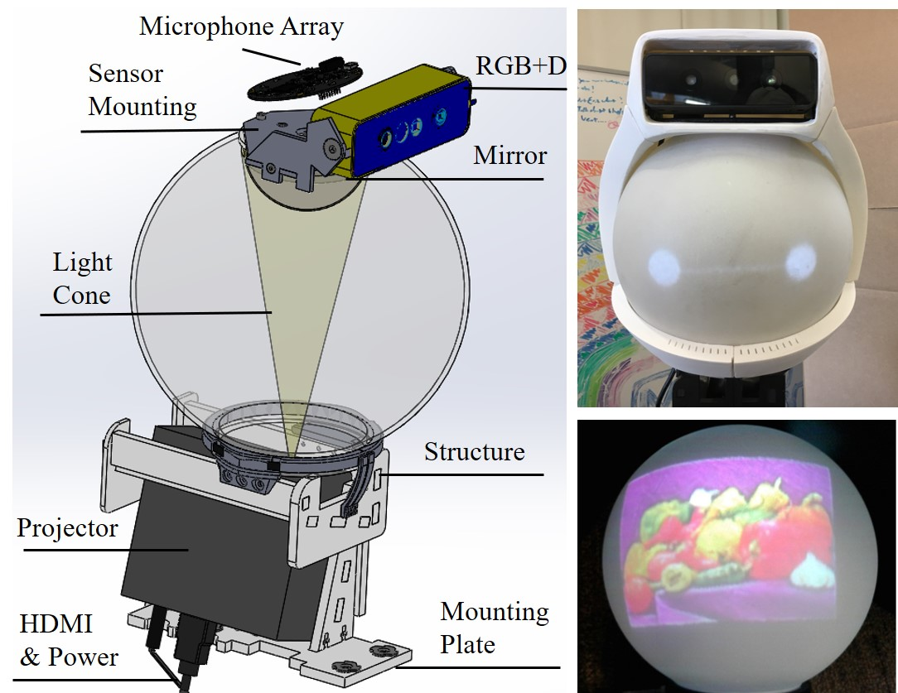

# Head

Quori's head module uses a retro-projected animated face (RAF) system. It consists of a small projector (115mm x 46mm x 105mm) and a domed mirror to map a projected image onto the inside of [specially-coated](https://store.gooscreen.com/Rear-Projection_p_27.html) thin sphere.

These components fit within a compact space approximately the size of an adult human head (200mm diameter) and weigh about 975 grams (excluding the RGB+D camera and microphone array). Software for using the head is provided and can be found in the Software section.

The projector is an AXAA P5 (US \$290) with key properties: it is rated to provide 300 lumens, last 20,000 hours, and have native 1280x720 HD resolution; however, only $\sim$132 lumens are available to the spherical surface since the image reflected on the spherical head is a circle inscribed inside the projection rectangle. The projector is affordable (at US\$290), has intermediate brightness, and short throw (20cm creates a focused 7.5cm x 12.7cm image). It creates a color image that is visible in most illuminated indoor environments where there is no sunlight saturation (Fig.~\ref{fig:headcad}, top). %

The mapping of projected images onto the sphere's surface is not uniform---the resolution is dense near the top of the head and sparse near the neck. The least dense equatorial line is approximately 200 pixels, compared to the highest ring, which has over 2,000 pixels; thus, creating expressive faces to be displayed on the spherical surface via a projected image is not trivial. Our mapping algorithm transforms pixels on the sphere to pixels in a 2D image to be sent to the projector. Details of the design and mapping used to project images to Quori's head can be found in our previous work \cite{weng2018low}.

The illusion of motion (e.g., head shaking, nodding, and gaze directing) can be produced through projection. Since the robot's head is a rotationally symmetric sphere with no protruding features (e.g., no nose or ears), head rotation can be simulated by projecting the image of a face rotating on the sphere without requiring additional motors or neck DoFs. Gaze direction can be simulated by coupling animation of the eyes with horizontal rotation of the whole upper torso ($M_T$ in Fig.~\ref{fig:basecad}). The waist joint (Fig.~\ref{fig:torsocad}) may also be useful in supplementing gaze, especially for interactions below or above the neutral gaze of the robot (e.g., for users who are shorter or taller than the robot) or for objects very near or far away. Sensors in the head can be replaced via fasteners on the sensor mounting plate. The camera field of view is discussed in Section~\ref{subsec:PowSysDesign} and shown in Fig.~\ref{fig:camerafov}.%

