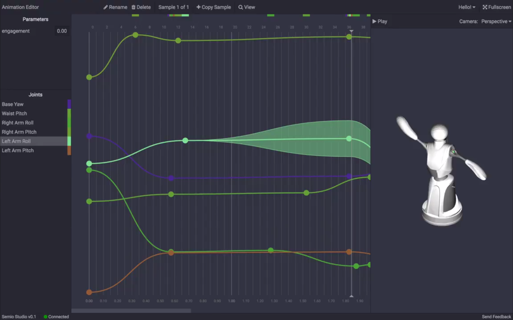
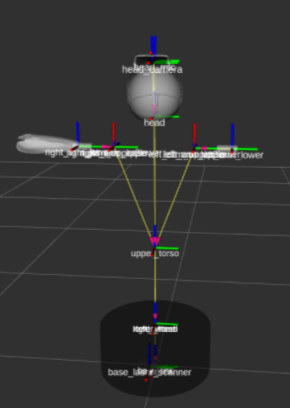

# Joints

The following section will provide a high level overview of the joints of the robot and its kinematics. More detailed information can be found at the [`quori_description`](https://github.com/Quori-ROS/quori_ros/tree/master/src/quori_description) repository.

## Joint Limits

- The base joints are all continuous revolute joints.
- The waist joint is revolute and has a range of `[-0.47,0.22]`, and is limited in both the low-level microcontroller and the quori_ros via the urdf.
  Mechanical stops exist to prevent the waist from going past these values.
- Each arm has two degrees of freedom. The pitch and roll for each arm is limited by the urdf.
  The roll is further limited in the low-level microcontroller code.
  The pitch degree of freedom can theoretically be used continuously if the mid-level software is updated.

## Joint orientation Information

<!-- TODO: find clearer frame description -->

