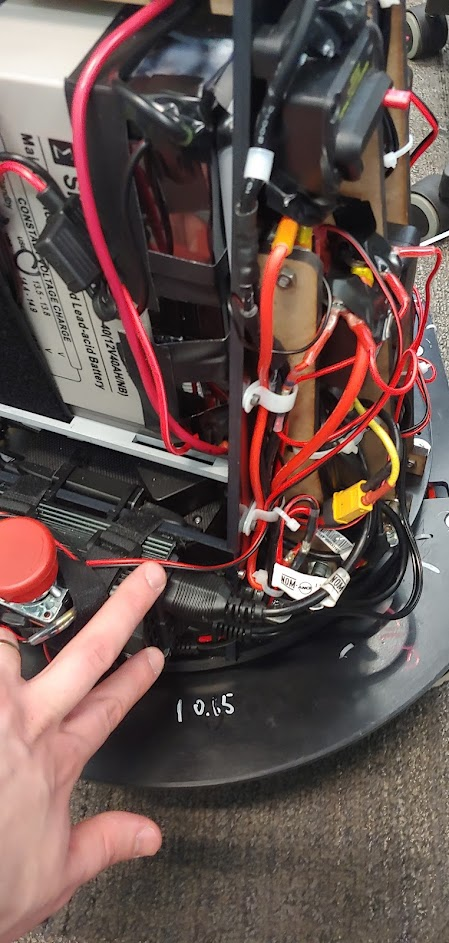
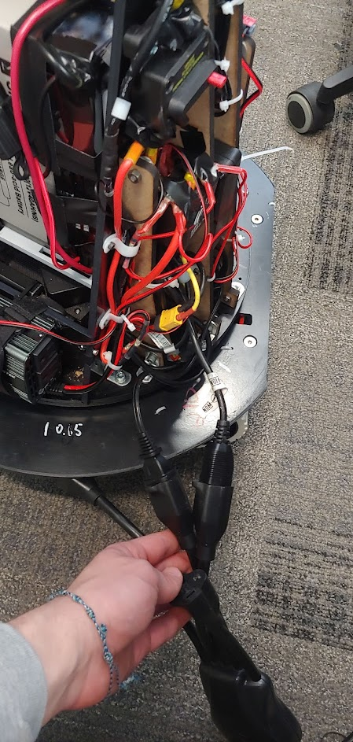
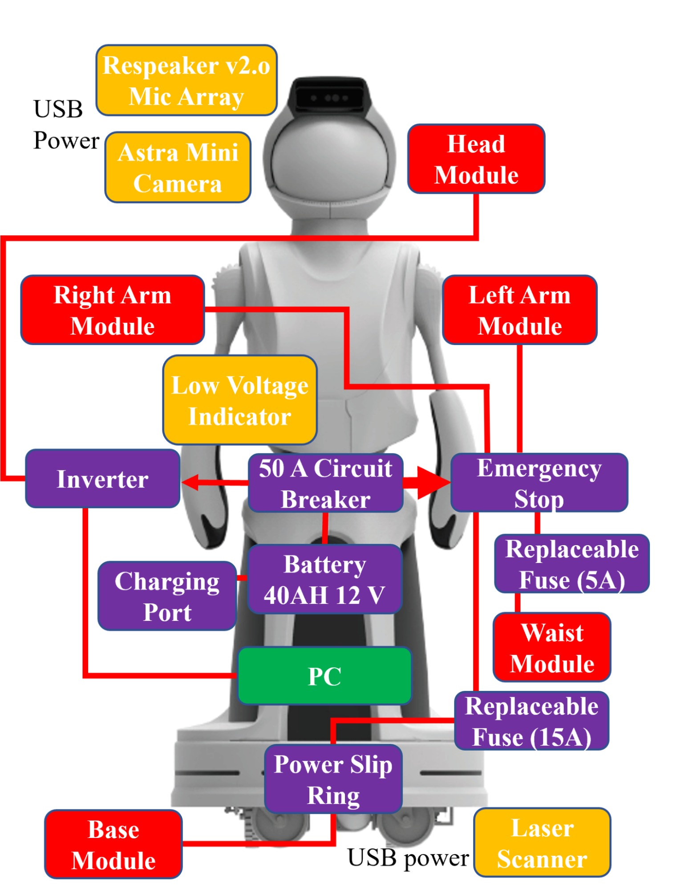

# Power

## Power System

Quori's power system was designed to operate untethered with the use of a 12V 40AH battery, which is also used as a counter balance. The battery is a Sealed Lead Acid (SLA) Absorbent Glass Mat (AGM) chemistry battery that is affordable (compared to lithium-based batteries) and stable without losing charge over long periods and has minimal risk of fires or acid spill. %

Shipping is also simplified as the battery only requires the use of a sticker stating ``non-spillable battery'' instead of additional regulations or costs. A potential downside of SLA batteries is the low energy density and high mass; however, we take advantage of this as a counterbalance, as discussed in Section~\ref{subsubsec:TorsoDesign}.

Most of the robot's subsystems are 12V-based; the only significant voltage switching occurs in a DC-to-AC power inverter, which allows for a main computer (e.g., a laptop) to be used on Quori without requiring the selection or design of an additional DC-to-DC voltage regulator. A simplified diagram of components is presented in Fig.~\ref{fig:powerOver}.

The robot can also run in a tethered mode when not mobile.

See [Recharging](../general_use.md#recharging) for more information on how to charge the robot.

## Power Configurations

You can power your Quori with the battery or use an external power source. Here are a few suggestions. Make sure your robot is off (the main breaker) before modifying any power configuration.

### Battery Only

This is the default configuration for Quori. Make sure the following is correct.

1. The battery is plugged into the robot’s main breaker
1. The PC and Projector AC plugs are plugged into the inverter

### PC and Projector External

Here the PC and projector plug into an extension chord into 120 AC Voltage

1. Turn off the inverter power switch
1. Unplug the PC and projector power cables.

   

2. Plug the PC and projector cables into a properly rated power cable.
   Be mindful of this cable if the robot is connected to the base.

   

### All External Power

You will need a DC power supply rated for 12 Volts at least 30 Amps to power the actuators. The power supply will need a Female XT-60 connector and will plug into the power in cable.

Above, the 12V DC circuit for Quori. Motor controllers receive power directly from the battery, while sensors receive power from the computer. The emergency stop controls power to the motors, but allows the computer and projector to remain on. The power charging port is within the battery bay.

1. Unplug the batter cable from the robot cable and cover the batter plug with a cover
1. Plug your DC power supply into the now open male XT60 connector on the robot
1. Note: A variation of this configurations uses both a DC power supply and AC external power. You can use a smaller DC power supply and implement the steps from “PC and Projector External”.
