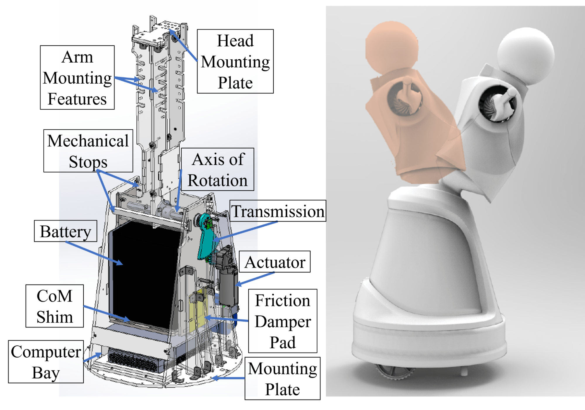
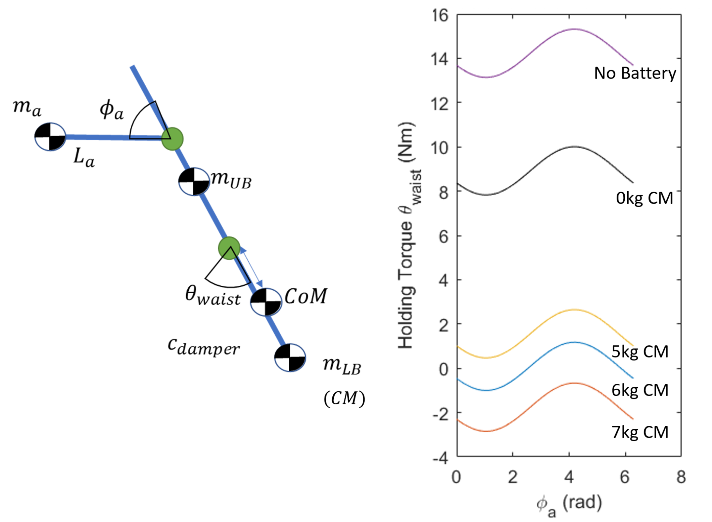

# Torso and Waist

Quori's torso module not only supports the arms and head, but also has one DoF to lean forward and backward. Here is the torso and waist hardware overview on the left, and the extreme positions the robot achieves on the right:

The robot can bow forward 30 degrees or lean back 15 degrees.  Mechanical limitations on the positions prevent self-collision.

This design also minimizes acceleration-induced swaying generated during the motion of the mobile base, leading to fluid, natural, and appealing tunable motion.

The batteries and onboard computer are stored in the torso.

The spine allows for easy attachment of additional custom hardware, such as arms or a head. A new head module can be attached to the spine using the provided mounting holes. The arms have similar mounting possibilities---shelves/ledges can be added to the spine for additional accessories, such as sensors, tablets, trays, container mountings, etc.

Considerable space is allotted for batteries and a computer\footnote{Quori currently ships with a nuc8i7hvk: Intel$^\copyright$ Core$^{\text{TM}}$ i7-8809G Processor with Radeon$^{\text{TM}}$ RX Vega M GH graphics (8M Cache, up to 4.20 GHz)}:  17cm x 15cm x 21cm and 20cm x 20cm x 7cm, respectively. Currently, the battery bay space fits a 40-ampere-hour sealed lead acid battery that powers the whole robot. While many options exist for small form factor computers, we have ensured sufficient space for a computer with computational resources suitable for real-world use, such as a NUC\footnote{\url{https://ark.intel.com/content/www/us/en/ark/products/126143/intel-nuc-kit-nuc8i7hvk.html}}  or NVIDIA Jetson TX1\footnote{\url{https://developer.nvidia.com/embedded/jetson-tx1-developer-kit}}.

Next, we present our approach to designing the single DoF waist which involves gravity compensation. The transmission design is also discussed.

## Gravity Compensation Design and Tuning of Waist Joint

Robot motion is often caricatured as jerky with overshoot; for example, a person pretending to be a robot might exaggerate leaning backwards as they start to walk forward, then sway forward and back just as they stop walking, as a cantilevered stick might do as a damped oscillator. Avoiding these types of motions typically requires expensive, strong motors and precise feedback.

Alternatively, adding mass to shift the center of mass (CoM) can change this behavior. A CoM below the axis of rotation causes the torso to lean forward during acceleration (opposite to the prototypical robot caricature motion), while a CoM at the axis of rotation reduces the motion.  %

Affordable actuation of the waist can be achieved with a counterbalance metronome design. This design leverages the mass of the robot's battery to offset the moment of the upper body of the torso, head, sensors, and arms. The moment that needs to be balanced changes, as the balance depends on the position of the arms $\phi_a$ which may be moving.
This model is used for tuning the CoM of the torso and waist actuator torque is shown below:

The masses are separated into the upper body mass $m_{UB}$ (head and arm transmission), the arm link mass $m_a$, and the lower body mass $m_{LB}$ (battery and counter masses). Right: Maximum waist holding torque curves used to select a starting counter mass (CM) configuration for the torso. The lines are produced by simulating the arms flexion, $\phi_a$, in order to produce the maximum waist torque, $\Ddot{\theta}_{waist}$, to hold the most difficult position of bowing forward.

The model abouve shows the torque required to hold the torso at its max bow position as the arms rotate in the plane. The effect of the extra counter-mass, the battery, and an ideal tuned counterbalance design is shown too. In its most difficult bowing position, the waist experiences a 16-Nm moment without counterbalancing (purple line). It is very challenging to find a motor with this capability, that is also small enough to fit in the required space and is affordable. Instead, with proper counterbalancing, the battery and an extra 6 kg (blue line), the peak torque requires less than 2-Nm.

The major drawback to this counterbalance design is the increased inertia of the torso. The waist does not need to move very fast---less than  1$\frac{rad}{s}$---nor accelerate faster than 1$\frac{rad}{s^2}$, which leads to a max accelerating torque of about 2.5 Nm; for reference, the max required static holding torque of the final design is approximately 2.5-Nm.%

To realize the counterbalance design, we used the model as a starting point (blue line), and manually tuned the final counterbalance configuration during construction. The battery bay structure (made from steel) provides both a stiff structure to support the battery and contributes about half of the needed 6 kg counter-mass. Steel plates and bars underneath the battery allow for high-resolution calibration of the counter mass. Proper calibration shows gauge values below 3.0 Nm, a torque achievable by our lower-cost (i.e., less than US \$100), low-profile actuator. This actuator---a window motor---is also quiet, especially when compared to small but high speed motors with larger gearing.

## Waist Transmission Design

A non-backdrivable transmission was chosen to minimize the energy required to bow so holding positions requires zero energy.

An optional locking pin feature allows for the torso motion to be locked for shipping or if waist actuation is not desired.

Friction damper pads on each side of the battery bay add dampening to the waist motion. The pads consist of soft foam and a PTFE sheet fastened to the battery bay, which push against an ABS plastic sheet. This design compensates for gear backlash and compliance in the structure and actuator and greatly simplifies smooth control. The damper increases the torque required to rotate the torso, but this effect was measured empirically to bring the waist motor torque to no more than 3.0 Nm, which met our goal.
