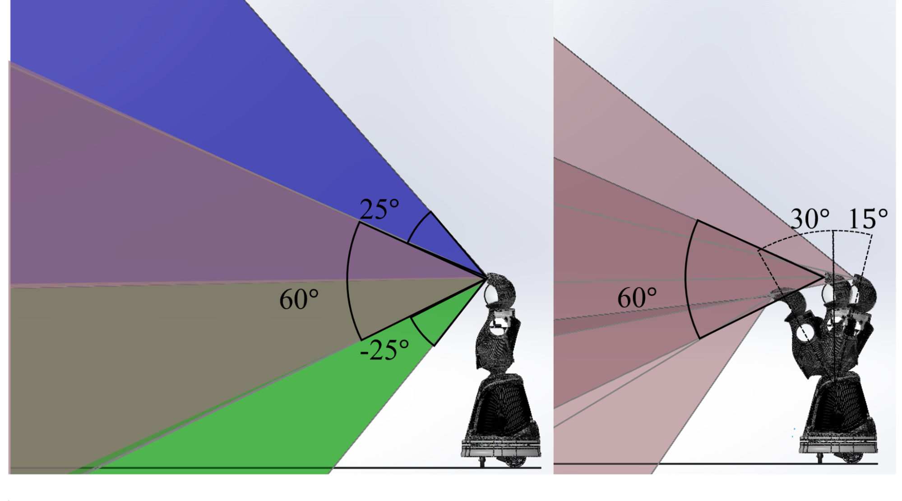

# Sensors for Interaction

Stereo speakers mount to a shelf on the upper torso behind the chest panel allowing for ample volume (60 dB SPL at 3 meters). Slots in the helmet provide the illusion of sound being produced in the head.%,

A ReSpeaker 2.0 four-microphone array mounts to the top panel of the helmet for sound localization and speech recognition (Fig.~\ref{fig:headcad}).
To test the sensor placement effectiveness for speech recognition, we performed a word error rate (WER) experiment using ten prerecorded English phrases produced from a hardware speaker at three distances (0.1m, 0.5m, and 1.0m), yielding an average WER below 13\%.
Additional or replacement microphones can be mounted inside the helmet.

An RGB+D camera mounts atop the robot's head to the sensor plate and fits inside the helmet (Fig.~\ref{fig:headcad}). The position of the camera gives the robot a $60^{\circ}$ H x $49.5^{\circ}$V FoV that follows the robot's gaze direction.

The camera is also plainly visible, which helps to set reasonable social expectations for what is in its FoV (Fig.~\ref{fig:camerafov}); this FoV can be manually adjusted to $\pm 25^{\circ}$. The current camera is an Orbbec Astra Mini\footnote{\url{http://shop.orbbec3d.com/Astra-Mini_p_40.html}} in a DuriPOD Case\footnote{\url{http://shop.orbbec3d.com/DuriPOD_p_47.html}}, which is 120mm x 37.5mm x 32.5mm, but can be easily replaced.

Quori's RGB+D FoV can be positioned by two means, manually and by rotation of the torso while the robot is moving. Left: FoV of the camera when positioned manually to neutral(red), $25^{\circ}$ maximum angle up (blue) and down (green). Right: Discrete sweep of the camera FoV at neutral position for three torso positions, $30^{\circ}$ forward, neutral, and $15^{\circ}$ backward.

<!-- TODO add snapshot of ROS software showing what's seen, and link to software section -->
