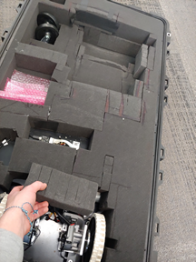
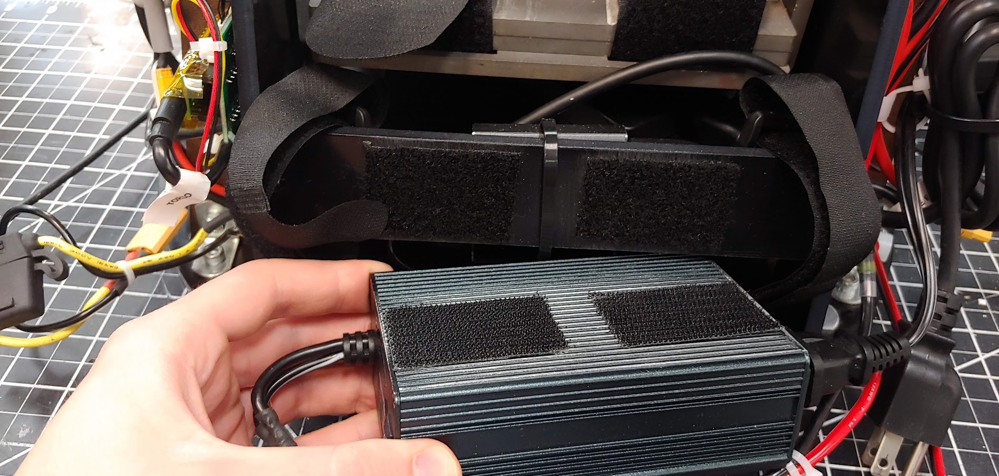
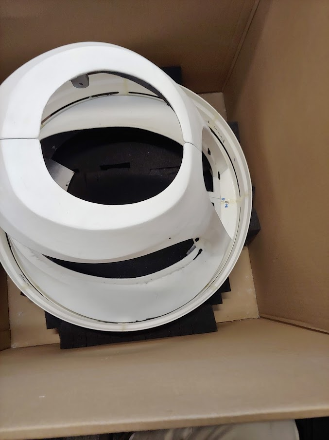

# Assembly

The main modules are the Torso, Head, and Base. The battery and speakers are removable for storage and assembly purposes. Below are all the parts you should have after removing them from the packages. The instructions below will walk you through how to unbox the parts and assemble the robot.

- Panels
- Head Module
- Base Main module
- Base casters
- Battery
- Remote controller
- Battery Charger
- Extra Fuses
- Speakers
- The upper torso module

## Materials Needed To Assemble the Robot

The linked items are examples of each item and the exact item is not necessary for assembly.

- [7/16” wrench](https://www.mcmaster.com/91826A120/)
- Hex drivers
    - [M4 drive](https://www.mcmaster.com/52975A18/)
    - [M2.5 driver](https://www.mcmaster.com/52975A16/)
    - [M1.5 driver](https://www.mcmaster.com/52975A14/)
    - And or a [kit like this](https://www.mcmaster.com/5709A44/)
- No.2 [phillips head driver](https://www.mcmaster.com/5682A39/)
- [Flat head driver](https://www.mcmaster.com/52985A32/)
- 2-3 people

## Unpacking

The robot will arrive in multiple packages. The panels are not needed for testing.

### Head Package (1 minute)

The head is packaged along and the box can simply be opened. Take off any packing supplies. A small piece of foam will be between the helmet and the globe at the chin; remove this.

### Pelican Case (10 minutes)

The next package is the pelican 1780 case. Lay the case on its side so the top half can be lifted off (the wheels should be on the ground). Unlatch all of the latches on the case, cut off any zip ties, and lift the top case off. The bottom half should have a foam layer labeled “3”. Take out the battery and the Material Safety Data Sheet (MSDS). Lift the battery by its sides, do not use the single handle. Do not pull on the wires. Take the battery cover (which is anti-static) off and leave it in the case.

Next, take the layer of foam off of the bottom half of the case to reveal the controller, charger, and speaker.

Then remove the torso. You should grab the Torso from the base plate and the waist, See the images below. Two people may be needed.

Next, take the next layer of foam out. There is a small block of foam cover the base motors that will also need to be removed. You can then pull the base out of the case. Also, take the casters, circled in red, out of the case.

## Prep

### Base Prep (5 minutes)

To assemble the base you will first attach the casters. The casters are held on with the 4 screws and nuts each. The screws are taped down and so reattaching should only require a 7/16 wrench. Attach the four nuts with a 7/16 wrench.

Next, remove the 14 M3 fasteners from the base top plate and keep them off to the side. These will be used soon.

### Torso Prep(1 minute)

The torso will be mounted to the base. Attach the blue or gray power inverter by lining up the black velcro. Then use the two velcro straps to secure the inverter as shown in the image. You will remove the inverter temporarily later. Make sure the velcro holds the wires near the bottom of the inverter as shown. [See video for reference.](https://photos.app.goo.gl/V5YV52wLGJYmUGME8)

**ATTENTION:** Before using the torso take out the two torso locking M3 bolts. The battery will not fit if these are left in.If you do not use the waist motor remove the 5 Amp fuse near the motor line. Then you can loosen the M3 bolt such that the battery can be placed in it. [See video for reference.](https://photos.app.goo.gl/qkKNyzurEaRbXw3x9)

### Head Prep (1 minute)

Take out the small piece of foam near the chin of the helmet.

## Torso and Base (25 minutes)

Note: You will need two to three people for this stage.Time:

The Torso will now be mounted on the base. There is only one configuration that is proper to mount the base and torso together. Read the next paragraph before trying to mount the base.

Match the front and back labels of the Torso and Base. Have one or two people lift the Torso by the bottom plate and the waist as shown in the image. You can also hold onto the MDF edge that connects to the steel and the lower ABS cross brace. A third person will guide the usb cable as well as the power cable from the base through the center hole and connecting slot of the Torso and under the computer. The usb cable will go to the left side of the robot, the side with the usb hub. The power cable will go to the right side of the robot. DO NOT pull on these cables as it may damage or sever the cable. If you lifted the PC make sure to reset it so it is laying flat in its bay. If it is not flat the battery bay will collide with it. The torso plate and the base plate should be flush with no gap between them. If there is a gap check all the bolts and holes align well. You may have to apply some pressure to seat the plate over the bolts. Be sure to check that no wires are pinched between the plates. [See this video for an example.](https://photos.app.goo.gl/Qs5bfcfJa8kdnrL27)

With the Torso seated on the base, plug the base’s usb cable into the usb hub.

Plug the power into the XT-60 cable labeled “BASE”

Next, attach the wire guides to the usb (the ¼” wire guide) and power cable (the two ⅜” wire guide) using an M2.5 driver. Unscrew the single screw holding the guide down. Insert the guide around the wire and put the screw through both tabs of the guide so that it holds in the wire.

Next install the 14 M3x14mm screws using an m2.5 driver. First unmount the blue power inverter by taking off the two velcro straps, see image. There are 3 screws in the front and back sections and 4 screws on each side section, see image.

Now verify the PC is sitting flat in its bay. If the PC is no longer flat (due to shipping or other movement) this may lead to collisions when the robot bows forward. The gap, shown in red below, should be greater than 18mm. If the PC power brick is under the ABS side wall edge this is guaranteed, see highlighted in blue in the image below and the two red circles in the right image.

You can now remount the inverter using the velcro straps. [See video](https://photos.app.goo.gl/V5YV52wLGJYmUGME8)

## Head to Torso (10 minutes)

Place the head onto the torso. Make sure the orientation is correct. The HDMI port should be on the back of the robot with the HDMI cable. Attach the head to the torso using 4 screws.

To attach the camera and microphone array you will need to take the helmet panels off of the head module. This panel may already be removed depending on the shipping box.

Take off the middle section using two hands. Pull it directly back to avoid scratching the head

Take off the two lower helmet pieces. These should easily pull apart from the two seems

Next unwrap the camera from the waist by removing the velcro and bubble wrap.

Mount the camera to the sensor carriage using the two screws already found in the camera. Using a phillip’s heaed screwdriver. Before tightening the screws use a straight edge to align the camera as shown in the image below.

Attach the 3 white panels of the helmet first. The lower smaller pieces first, followed by the larger middle section. Be careful to not scratch the globe. [See video for reference](https://photos.app.goo.gl/pUeqEAdTautJ5Z4A7)

Attach the unconnected long micro usb cable from found in the wire guides to the top helmet. You will need to remove the two screws using an m1.5 driver to insert the usb connector into the sensor. Screw the sensor into the helmet as shown. The sensor should push securely against the part, but be careful to not overtighten.

Finally, attach the top helmet piece in the reverse order shown below. Make sure the Camera cable is along the robot’s left side and the microphone cable is along the left side.  [See video for reference](https://photos.app.goo.gl/pUeqEAdTautJ5Z4A7)

## Speakers (5 minutes)

- To mount the speakers remove the pate mounted near the waist with a thumb screw. Screw the thumbscrew back in to avoid losing it.Take the two screws with nuts off the bracket using an M4 driver and fingers to hold the nut. Be Careful to not drop any parts. Screw the panel UNDER the bracket with the nut and bolt using an M4 driver and fingers to hold the nut. Make sure the panel mounting matches the image, the bracket should be showing above the black panel.

Install the speakers into their mount. They will simply press into the jack on the panel. Each speaker can be mounted to either jack.

## Battery (5 minutes)

Before installing the batteries you will need to remove or replace the locking M3 bolts. Note the battery is 24 pounds. A video link is provided at the end of these instructions.

**ATTENTION:** Before using the torso take out the two torso locking M3 bolts. The battery will not fit if these are left in.If you do not use the waist motor remove the 5 Amp fuse near the motor line. Then you can loosen the M3 bolt such that the battery can be placed in it. [See video for reference, note the two locations might be mirrored for each robot.](https://photos.app.goo.gl/qkKNyzurEaRbXw3x9)

**ATTENTION:** Make sure the main breaker is OFF before starting this step.

Unwrap the two velcro straps.

Make sure the two steel counter mass plates are centered on the bottom steel plate and fit tightly against the side walls. The robot may struggle to move the waist If the counter plates are not centered. The front and back edges of the steel plates should be flush with the slot in the bottom plate that the velcro straps enter into, i.e the two plates should be be touching the velcro straps.

Next, slide the battery into the back of the robot and into the battery bay such that the battery cables are in the upper right corner of the robot’s battery bay. Be sure that the two counter mass plates do not shift. This is easiest to do from the back of the robot. The battery power cable will need to be positioned around the waist hex shaft inorder for the plug to be connected to the rest of the robot.

Then strap the battery into the bay with the two velcro straps. Be sure to secure the charging cable to the battery with the velcro straps.

[See this video as a reference](https://photos.app.goo.gl/EmhqyahyTrDJVjVU6)

## Panels

Open the large box with the panels so that the shipping label is facing up.

Carefully remove the packing material from around the panels

Remove the plack service panels from the lower torso

You should now be able to remove the bubble wrapped panels from the inside of the lower torso. Parts to remove are shown below: the black waist front and the black waist back, and the 4 chest pieces, and the two lower arms.

Then carefully pull out the lower torso from the skirt (the fit is tight). Use the vertical beams (circled in red) in the front to help support the panels as you remove the part

The remove the laser scanner skirt from the box

Then remove the three thumb screws (red stars in the image below) that hold the two halves of the lower torso together. Do not lose these screws.

### Waist (6 minutes)

- Take off the four thumb screws near the waist, see image
  

Note that the two pieces are not interchangeable and the one labeled front should be on the same side of the robot as the speakers. The front piece is the one with male (protruding) alignment cones. Attach the waist to the torso using the thumbscrews. Put the thumbscrews into the waist tabs and then align the waist and then screw the thumbscrews hand tight. Be careful to not catch any wires under the plastic part.

### Lower Torso (10 minutes)

Place the skirt on the base. You may need to position the arms so the skirt can move around them.

Place the right lower torso panel next to the robot (with the usb and HDMI cables) Next, plug in the USB and HDMI cables into the extensions.

Next attach the panel, using the thumbscrew, to the top of the torso's black ABS plate on the robot, see below images. Place the thumbscrew in the lower torso’s mounting tab before mounting the part.

Check that the cables do not hang below the panel as it can get caught if so.

Repeat for the left lower torso part, first connecting the E-Stop wire and then mounting the panel to the robot

Check that the cables do not hang below the panel as it can get caught if so.

Next fasten the remaining three thumb screws that connect the left and right lower torso panels. There is one in the lower front, one at the lower back, and one at the upper back. The thumbscrew should enter the left lower torso tabs and thread into the right lower torso tabs. The three panel-to-panel thumbscrew locations are shown at the first part of [this video](https://photos.app.goo.gl/oeT37nUdAHztNtrM7) and the left and right panel-to-robot thumbscrew locations are shown at the end.

### Upper Torso (10 minutes)

- Move the right arm outward before attaching the left panel. Unscrew the M3 thumbscrew by hand. Be careful that the screw does not fall into the robot. Place the screw on the torso panel first and then moving the chest panel into place. Screw the screw into mounting panel as shown [in the video](https://photos.app.goo.gl/BrKEe9UhvjubWydK6). The right panel mounting tab should be below the torso mounting panel as shown in the image below.

  

- Move the left arm outward before attaching the left panel. Unscrew the M3 thumbscrew by hand. Be careful that the screw does not fall into the robot. Place the screw on the torso panel first and then moving the chest panel into place. Screw the screw into the mounting panel as shown [in the video](https://photos.app.goo.gl/BrKEe9UhvjubWydK6). The left panel mounting tab should be below the torso mounting panel as shown in the image below. below the torso mounting panel as shown in the image below.

  

- Attach the low voltage sensor wire to the right panel. [See the start of this video for reference.](https://photos.app.goo.gl/BrKEe9UhvjubWydK6)

  

- Follow the images below from right to left. The front panel should only be placed with the helmet off or at least the lower two chin pieces of the helmet. Magnets will hold this part in place to the left and right chest pieces. [See video for reference](https://photos.app.goo.gl/nCV269JdHhSYMYxR6)
  

- The back chest panel should easily slide into the three mounted pieces and be held in place with its magnets. Make sure the microphone usb cable is to the left and fits in the notch on the left side of the panel and the camera usb cable fits in the notch on the right side of the panel. [See video for reference](https://photos.app.goo.gl/pVsqCjMgy8gzaXpE6)
  

### Helmet (5 minutes)

Attach the 3 lower panels of the helmet first. The lower smaller chin pieces first, followed by the larger middle section. Be careful to not scratch the globe.

Finally, attach the top helmet piece in the reverse order shown below. Make sure the Camera cable is along the robot’s left side and the microphone cable is along the left side. [See video for reference](https://photos.app.goo.gl/pUeqEAdTautJ5Z4A7)

### Lower Arms (2 minutes)

- You can attach the lower arms by tightening the set screw in the arm with a m1.5 driver. You should only need to turn the set screw 3-5 revolutions. Do not overtighten the set screw. The arms should be installed so the thumbs (the smaller protrusion on the hand) faces forward. This can be repositioned as desired. [See video for reference](https://photos.app.goo.gl/KYkmWwLNfFFDszBu9)

### Service Panels

The back service panel uses velcro to attach to the lower torso panels. Start with the robot’s right side and align the velcro strips. Work your way to the robot’s right side, aligning the velcro along the way. The bottom of the robot’s right side will have a gap large enough to fit a finger through. This is used to remove the panel for servicing. [See video for assistance in assembly](https://photos.app.goo.gl/utFK21QJGESzKGGa9)

The front service panel attaches to the lower torso panels with velcro.

