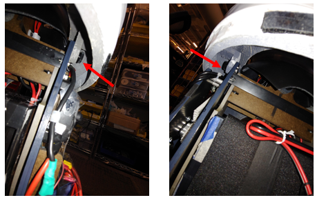

# Disassembly

Be sure to turn off the main ON/OFF relay switch before maintaining the system. Note that most of the panels are held in place using magnets. Some of the connections use screws.

Make sure all power is off and not connected when servicing the robot. Turning off the main ON/OFF relay switch will do this. You may also want to unplug the battery. When you unplug the battery from the robot be sure to place the connector cover over the battery connector.

## Panels

### Helmet (2 minutes)

- Take off the top sensor cover. Pull out towards the front of the robot and rotate its back forward as shown in the images. You may want to unplug the microusb from the audio sensor or unscrew it from the helmet using an m1.5 screw driver.
  

  

- Take off the middle section using two hands. Pull it directly back to avoid scratching the head
  

- Take off the two lower helmet pieces. These should easily pull apart from the two seems
  

### Chest (2 minutes)

- Separate the front and back chest pieces using two hands. See images. Then pull off the back panel. Be careful to not let the front panel fall off.
  

- Lift the front panel up and out slightly. Then rotate the bottom of the panel outward. Finally pull the panel off the robot. See three images.
  

- Move the left arm outward before removing the left panel. Unscrew the left panel by hand from the thumbscrews. Be Careful that the screws do not fall into the robot. Screw the thumb screws into the panel when done.
  

- Unplug the low voltage LED cable. [Do reverse of this video](https://photos.app.goo.gl/DLZs375Z8pCyDxSYA)
- Move the right arm outward before removing the right panel. Unscrew the right panel by hand from the thumbscrews. Be Careful that the screws do not fall into the robot. Screw the thumb screws into the panel when done.
  

### Lower Torso (15 minutes)

- Take off the front and back service panels by pulling the panel off. The images below show the locations that will allow a finger to start separating the service panel from its velcro attachment. The bottom right side for the back service panel and the bottom for the front service panel.

- Unscrew the 3 thumb screws that connect the left and right lower torso panels. There is one in the lower front, one at the lower back, and one at the upper back.
  

- Unplug the HDMI, usb, and emergency stop wires from the panel
  

- Unscrew the left thumb screw that holds the lower torso to the robot structure. Be Careful not to drop the thumbscrew. Repeat the same process on the other side. Reinstall the thumbscrew in the hole after the panels are removed to prevent losing them. Do not screw the thumbscrew past the insert as this could block the robot bowing motion if the robot is run without the panels.
  

- Pull off each side. Note that a magnet pulls the two lower halves together at the front top and the base skirt also connects to both sides using magnets.
  

- Take off the base skirt. You will need to lift one arm up and have the other arm down to do this unless you take off the lower arms
  

- Remove the lower arms by loosening the set screw in the arm with a m1.5 driver. You should only need to turn the set screw 1-3 revolutions. Do not remove the set screw.
  

### Waist (3 minutes)

- Take off each waist by unscrewing the top and bottom thumb screws, see images for examples. Note that the two pieces are not interchangeable and the one labeled front should be on the same side of the robot as the speakers. The front piece is the one with male (protruding) alignment cones.Be sure to put the thumb screws onto the robot to prevent losing them.
  

  

## Head (15 minutes)

Make sure all power is off and not connected to the head module. Turning off the main ON/OFF relay switch will do this.

- Unplug the HDMI, and power cable from the bottom of the projector.
  

- Disconnect the camera. For the camera you can either take the camera off its mount or unplug the camera usb cable and unrouting it from its two guides. We recommend removing the camera. To remove the camera from its mount use a Phillips head screwdriver two take the two screws off holding it to its mount. Install the screws into the camera to avoid losing them, see image. You should then store the camera in the torso right side as shown in the below image using a velcro strap. Wrap the camera with bubble wrap to help protect it.
  

  

- Either carefully place the top head panel and microphone off to the side, or remove the microphone usb cable and allow it to hang next to the camera.
- You need to pull out the speakers from their mount to remove the head. See images of the four screws and the unmounted speaker. You may want to take the torso mounting plate off before removing the head. See next step if so.
  

- You need to take the torso mounting plate off to remove the head. Take the two screws with nuts off the panel using an M4 driver and fingers to hold the nut. Be Careful to not drop any parts. Screw the nut and bolt together on the bracket after removal. Mount the plate as shown in the imaging using the front waist’s top thumb screw.
  

  

    - Remove the 4 screws holding the head module to the torso using an m4 driver, see next step before proceeding. Only remove the four black screws, they should be vertical and going into the black ABS peices, that is, do not take out the screws going into the MDF structure. Screw the 4 bolts into the head plate to avoid losing the screws.
  

## Base and Torso (20 minutes)

Make sure all power is off and not connected to the base module. Turning off the main ON/OFF relay switch will do this. You will need three people to do this.

Before attempting to remove the torso from the base you will need to unplug the power cable and the usb cable as well as 14 screws using an m2.5 driver. It is best to have **three people** to help lift the robot and guide the cables through. The instructions below will detail this.

You may want to take the battery out of the robot to make it easier to lift the robot. Again, make sure the main relay is off before doing this. You will unplug the xt-60 connector. You should cover the battery xt-60 connect an XT-60 cap as a safety precaution. Then move the wire under and out of the structure, see image. Then, take off the two velcro straps. Then carefully pull the battery out towards the back of the robot. Note the battery weighs about 24 pounds. You may want to insert two M3x60 bolts into the waist to lock it in place. Do the reverse of the following:

Before installing the batteries you will need to remove or replace the locking M3 bolts. Note the battery is 24 pounds. A video link is provided at the end of these instructions.

**ATTENTION:** Before using the torso take out the two torso locking M3 bolts. The battery will not fit if these are left in.If you do not use the waist motor remove the 5 Amp fuse near the motor line. Then you can loosen the M3 bolt such that the battery can be placed in it. [See video for reference, note the two locations might be mirrored for each robot.](https://photos.app.goo.gl/qkKNyzurEaRbXw3x9)

First unplug the base power plug located on the robot’s right side. Then, remove the wires from the guides by taking off the two guides using an m2.5 driver, see images. Reattach the guides sans power wire to prevent losing the part. Next unplug the base serial cable from the usb hub on the left side of the robot. Then take off the wire guide using an m2.5 driver.

Next take the 14 screws off using an m2.5 driver. First unmount the blue power inverter by taking off the two velcro straps, see image. There are 3 screws in the front and back sections and 4 screws on each side section, see image. screw these 14 screws into the base holes to prevent losing them. Leave the inverter velcro straps hanging where they were.

**You will need at least two people for this step**. Next, you may need to lift the PC to help guide the power and usb cable through the mounting hole/slots. Then have two people lifting from the lower back brace and the waist of the robot while a third person guides the usb and power cable under the torso module and out, see image.

Screw the 14 M3 screws into the base to avoid losing them.

For storage into the pelican case you will need to remove the casters. The casters are held on with the 4 screws and nuts each. The screws are taped down and so removal and reattaching should only require a 7/16 wrench. Remove the four nuts with a 7/16 wrench and then remove the caster. Reattach the 4 nuts to the screws hand tight to prevent losing them.

If you are shipping the torso unit please consider installing the two M3x60 bolts that lock the battery bay inplace. This will help reduce stress on the waist transmission during shipping.
