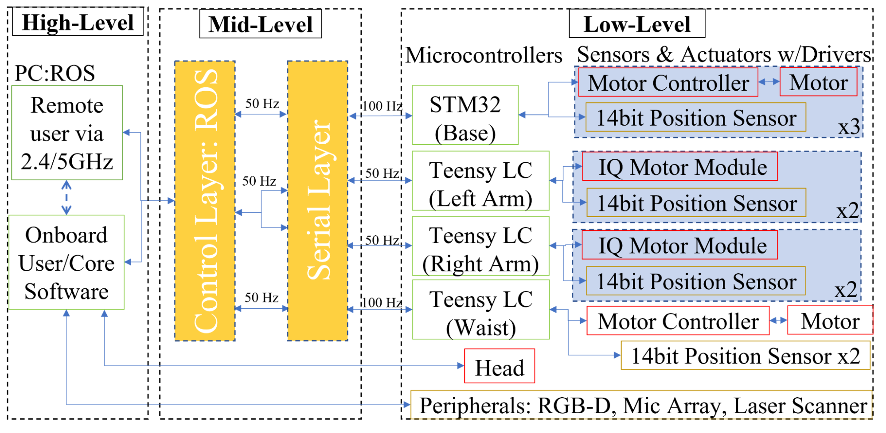

# Software

## Overview

This sections provides links to the software repositories for Quori as well as information about the computer and microcontrollers. For detailed information about using Quori with ROS please visit Quori’s ROS wiki page at: http://wiki.ros.org/Robots/Quori.

Quori has two main software categories: (1) low-to-mid-level, including core control of each module (actuation and sensing); and (2) high-level social interaction software (animation and dialog tools).

ROS is used for mid-level control of modules. PC usage is in parallel with the microcontrollers that control motor position, speed, measurements, safety, etc.

<!-- TODO: talk about Semio's layer on top of that -->

## Repositories

The following are links to the software repositories that are already installed on your Quori robot.

### ROS packages for Quori

- [https://github.com/Quori-ROS/quori_ros](https://github.com/Quori-ROS/quori_ros)

- [https://github.com/Quori-ROS/quori_ros/tree/master/src/quori_face](https://github.com/Quori-ROS/quori_ros/tree/master/src/quori_face)

- [https://github.com/Quori-ROS/quori_ros/tree/master/src/quori_controller](https://github.com/Quori-ROS/quori_ros/tree/master/src/quori_controller)

- [https://github.com/Quori-ROS/quori_ros/tree/master/src/quori_launch](https://github.com/Quori-ROS/quori_ros/tree/master/src/quori_launch)

### Linux OS for Quori

[https://github.com/Quori-ROS/Qubuntu](https://github.com/Quori-ROS/Qubuntu)

### Embedded Code for Microcontrollers

[https://github.com/Quori-ROS/quori_embedded](https://github.com/Quori-ROS/quori_embedded)
