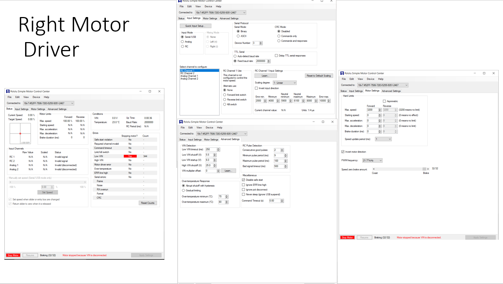

# Microcode

- Microcontroller for the arm, and waist modules: [Teensy LC](https://www.pjrc.com/teensy/teensyLC.html)
- Embedded Code for the arms and waist modules: [https://github.com/Quori-ROS/quori_embedded](https://github.com/Quori-ROS/quori_embedded)

- Microcontroller for the base: [NUCLEO-F303K8](https://www.st.com/en/evaluation-tools/nucleo-f303k8.html) (remove and jumpers from the microcontroller before using)
- Code for the base module: [https://github.com/Quori-ROS/quori_embedded](https://www.st.com/en/evaluation-tools/nucleo-f303k8.html). For the NUCLEO microcontroller you may need to:
  - Update your computer to have the latest driver [https://os.mbed.com/platforms/ST-Nucleo-F303K8/](https://os.mbed.com/platforms/ST-Nucleo-F303K8/)
  - Update the mbed to have the latest firmware update [https://os.mbed.com/platforms/ST-Nucleo-F303K8/](https://os.mbed.com/platforms/ST-Nucleo-F303K8/)

Instructions for installing the software to the microcontrollers can be found on at the repository: [https://github.com/Quori-ROS/quori_embedded](https://github.com/Quori-ROS/quori_embedded)

To replace a microcontroller you will need to make sure it has the necessary number of header pins solder on the board to plug into its receptacle. Use the broken or old microcontroller as an example.

## Flashing Motor Drivers

There are four motor drivers that can be programmed. It is not recommended that you alter these. If you need to alter the program or recover the driver’s settings please use the following settings. Note that the Waist/Torso controller is the G2 version of the controller and needs the G2 Pololu program.

### Base Motor Controller Settings

The three base motor controllers (Pololu Simple Motor Controller 18v7)  are found soldered to a PCB on the base. Use a usb-mini cable to connect to the controller (You will probably need to partially disassemble to base to access all of the usb headers). The built in software is very convenient and easy to use. Most of the settings used on this project remain as the default. However, some settings were immediately changed. First, make sure that you go to advanced settings and make the Command Timeout (s), 0.1 second or 100 ms. Ideally the microcontroller sends a command to the motor drivers every millisecond, so this feature activates when the motor driver hasn't received a command in 100 cycles. This basically prevents the motors from moving when the arduino loses power or resets. Another setting that must be changed is the Device Number under input settings.This is the setting that determines which motor controller actually uses the serial packet sent out. In the current circuitry setup, assign 1 to the turret motor controller, 2 to the left motor controller, and 3 to the right motor controller. Also make sure that
- disable safe start selected
- set the device number right(3) left(2) turret(1)
- change baud rate to 2000000
- check which motors need to be inverted
	- You may have to test this.
- set motor command timeout to 0.1

> The images below are for reference. Read the instructions first as some values may need to be changed such as the “motor direction inverted” parameter

### Waist/Torso Motor Controller Settings

You should make sure the controller is programmed first.
[https://www.pololu.com/docs/0J77/3.1](https://www.google.com/url?q=https://www.pololu.com/docs/0J77/3.1&sa=D&source=editors&ust=1703158334607634&usg=AOvVaw1tAte1inyE-RffXPiGazof)
The waist is the G2 motor controller.

Use the following settings:

- Input Settings
  - Baud rate: Automatic detect
  - Motor ID: `1`

- Motor Settings
  - Current limit
    - Measure the current calibration
      - The easiest way to set the “Current offset calibration” setting is to connect power to VIN, make sure the motor is stopped, and then click the “Measure” button to measure the offset and automatically change the setting.
    - Set the current limit to 4A
  - Invert Motor Direction
    - Use the motor controller software to command a positive speed. If the motor rotates CCW (axis pointing into the robot from the motor shaft) and thus the Torso CW( a forward bow towards 30 degree limit) then the direction is correctly set. Otherwise, toggle the “Invert motor direction” box.
      - You may need change the command timeout to `0.0` temporarily to do this.
  - Advanced Settings
    - VIN low shutoff: 3.0V
    - disable safe start selected
    - Command Timeout: 0.1
