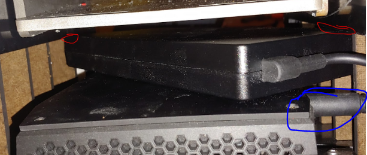
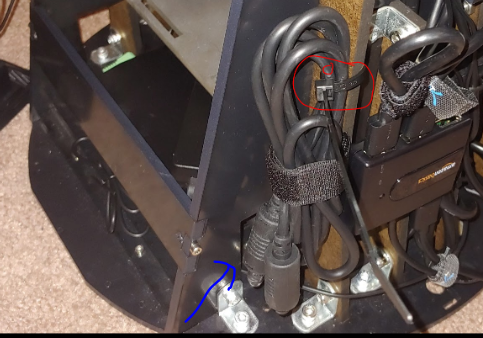
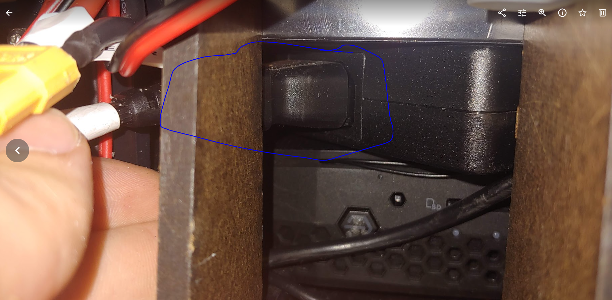

# Troubleshooting

## Computer

### The PC will not turn on

-   If you are running the PC from the inverter on the robot (for
    battery power or external AC2DC) Check that the power switch
    on the inverter is set the the "ON" position.

-   Try holding the PC power button down for a 2-5 seconds

-   Try testing the PC connected to AC power instead of the inverter

-   Try running the PC from an [*external power
    source.*](#_xnuyyfdvc92x) If this does not work check for
    unseated power cables

    -   Check the power cable has not become unseated at the DC end
        which plugs into the computer (see blue circle)

        -   

        -   

    -   Check the AC power cable plugging into the power brick. You
        can access this from the back-right of the robot. The power
        brick is between the computer top and the battery bay bottom

        -   

[]{#anchor-58}Communication/Control General

## Module will not connect to software control

-   Check the micro usb cable is plugged into the microcontroller.
    If not you might get a joint state failure message. Check at
    the USB A and micro usb ends of the connection

## Joystick Node Control Not working

-   The "Mode" button LED should not be on. Press the "Mode" button
    to turn the LED off. If the LED is on the buttons and axis may
    not work properly

## Laser scanner:

-   Operation Time Out things to try:

  -   Unplug and replug the white 5 wire cable that connects the
      laser scanner to the usb cable.
  -   Unplug and replug the microUSB cable side
  -   Unplug and replug the USB A side into the hub

-   USB port binding error

  -   Unplug and replug the white 5 wire cable that connects the
      laser scanner to the usb cable.
  -   Unplug and replug the microUSB cable side
  -   Unplug and replug the USB A side into the hub

## Head

### The head is not displaying

-   Is the projector on?

    -   If the projector has power a blue screen should show in the
        head and the LEDs on the projector case should be blue.

-   Is the HDMI cable plugged in and working properly?

    -   Make sure the cables are connected properly
    -   Try to plug a different cable into the projector to test if
        the cable or the HDMI switch is working.

-   The HDMI splitter might not be functioning properly. Sometimes
    unplugging the usb power to the splitter can solve the issue.
    Alternatively, plugging the usb power in might also help. Do
    this when the robot is shut off, that is do not do this while
    the robot is powered on.

-   If the screen is only displaying one shade of colors, you might
    also try unplugging the projector cable at the projector (the
    barrel jack) and inspecting for any debris and plugging it
    back in.

## Arms

### The arms are not moving

-   Check that the arms are not past the safe position. There is a
    limit in the microcontroller for the abduction/adduction DOF
    that when it passes it the arms are not allowed to move. You
    can carefully lift or lower the arm to the neutral and try
    again. Be sure to shutdown the motor power before backdriving
    the robot

-   A possible USB problem

    -   Check that the two microcontrollers have their orange light
        lit.

-   A possible power problem

    -   Did the motors make a boot up noise when power was added?
        They should.
    -   Are all of the power cables going into the arm plugged in
        securely? If they fall out you can add a zip tie to hold
        them in place.

### The arms are not moving smoothly or are stuck

-   Check for debris in the transmission using a flash light.

-   Check that the friction roller (blue rubber on the motor shaft)
    is not loose and spinning freely wrt the shaft

-   Try replacing the friction roller. You may have a roller that
    has hardened over time or a flat spot in the rubber or a
    defect that is leading to binding.

-   [*Removing an
    Arm*](https://docs.google.com/document/d/1SW8W3DWEnLwRcqzqAt5aR98D3iOFh1PbWp9Uus8lFXk/edit)

-   Replacing friction roller in arm

## Base

### No data connection

-   Check that all the usb plugs are plugged in. When the robot is
    connected correctly to a computer the microcontroller will
    have a light on and so will the position sensors and the USB
    hub. The laser scanner will also spin.

### The Base is not moving

-   Check if the fuse is blown. If it is blown you will need to
    replace the fuse before the module can operate. Be sure to
    identify the source of the fuse blowing before replacing the
    fuse as it would be best to fix any issue first.

## Torso:

### The Torso is not moving

-   Check if the fuse is blown. If it is blown you will need to
    replace the fuse before the module can operate. Be sure to
    identify the source of the fuse blowing before replacing the
    fuse as it would be best to fix any issue first.

### The Torso motion is jerky.

-   The counter mass may not be correct. Check the default
    configuration for the counter mass. There should be two steel
    plates at underneath the SLA battery. The battery MUST be
    centered in the battery bay.

    -   Depending on the configuration of the robot the counter mass
        may need to be reconfigured. The nominal balancing is
        achieved with two plates under the battery. The process can
        be found[*
        here*](https://docs.google.com/document/d/1OgrDanyNGVuu0mdfz35nZMCD3Q8guNHyjoSJP6imKj0/edit)
        to verify this or to counter balance the system under
        another configuration.

-   Check that the motor gear is not slipping

-   Check that the torso hub (large metal flanged hub at the center
    of the robot) connection to the hex shaft is secure.

-   Check that the wedge gear connection to the hex shaft is secure.

-   Check that the data and power wires the route up the torso frame
    and into the upper torso that is rotating do not get caught as
    the robot rotates.

-   Check that the battery is secured well by the two velcro strap.
    The battery may shift if it is loose which will cause the
    motor to struggle to move the torso smoothly.

-   Make sure the power brick for the PC is securely under the
    computer bay ledge. If it is not the the power brick might not
    be level and may go above this height. If the brick is above
    the computer bay ledge it can collide with the torso causing
    the torso to stop or the power to turn off. There should be
    19mm of clearance between the computer's power brick and the
    steel bottom plate of the battery bay. If there is less than
    this (especially less than 14 mm) you should check that the PC
    is seated well in its bay and there is no debris caught under
    it.

## Battery Installation

### Difficulty installing the battery

-   Make sure the cable is not getting caught when you install the
    battery

-   The battery fits snuggly into the steel bay. The battery should
    fit well if you insert the battery such that it is aligned
    with the compartment. Inserting the battery at an angle could
    lead to it getting stuck.
